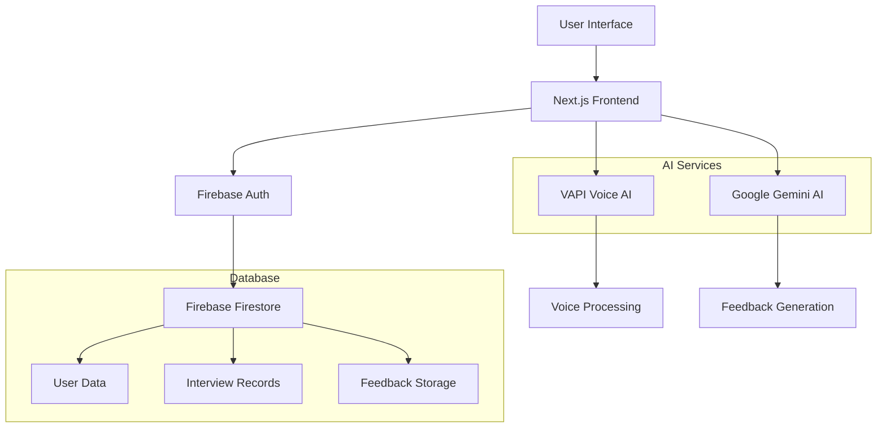
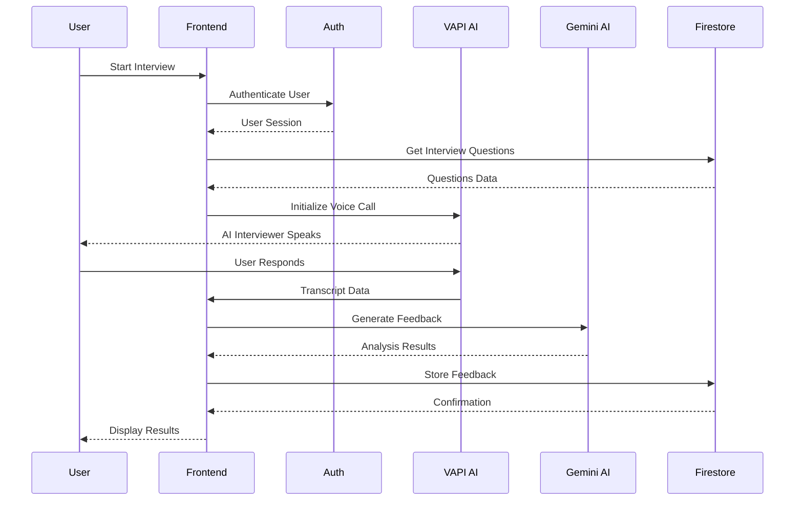
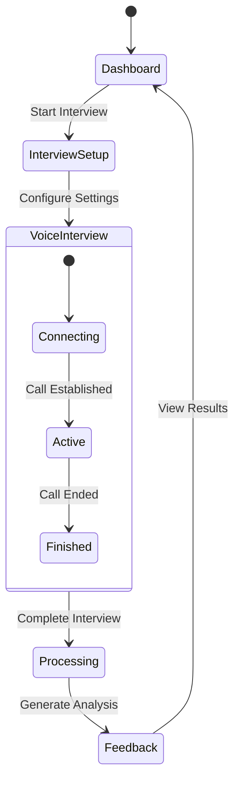

# MockMate AI Interview Platform

An AI-powered mock interview platform that helps job seekers practice and improve their interview skills through realistic AI-driven conversations and detailed feedback.

## 🌟 Features

- **AI-Powered Interviews**: Real-time voice conversations with AI interviewers
- **Personalized Feedback**: Comprehensive analysis across multiple categories
- **Multiple Interview Types**: Technical, behavioral, and role-specific interviews
- **Tech Stack Support**: Support for various technologies (React, Node.js, Python, etc.)
- **User Authentication**: Secure Firebase-based authentication system
- **Interview History**: Track and review past interview performances
- **Real-time Transcription**: Live speech-to-text during interviews

## 🏗️ Architecture Overview



## 🚀 Tech Stack

### Frontend
- **Next.js 15.3.1** - React framework with App Router
- **TypeScript** - Type-safe development
- **Tailwind CSS** - Utility-first styling
- **Radix UI** - Accessible UI components
- **Lucide React** - Icon library

### Backend & Services
- **Firebase** - Authentication and Firestore database
- **VAPI AI** - Voice conversation platform
- **Google Gemini 2.0** - AI-powered feedback generation
- **AI SDK** - AI integration utilities

### Development Tools
- **ESLint** - Code linting
- **Prettier** - Code formatting
- **TypeScript** - Static type checking

## 📊 Data Flow



## 🗂️ Project Structure

```
MockMate AI Interview platform/
├── app/                          # Next.js App Router
│   ├── (auth)/                   # Authentication routes
│   ├── (root)/                   # Main application routes
│   ├── api/                      # API routes
│   ├── profile/                  # User profile pages
│   ├── globals.css              # Global styles
│   └── layout.tsx               # Root layout
├── components/                   # Reusable React components
│   ├── ui/                      # Base UI components
│   ├── Agent.tsx                # AI interview agent
│   ├── InterviewCard.tsx        # Interview card display
│   ├── AuthForm.tsx             # Authentication form
│   └── ...                      # Other components
├── lib/                         # Utility libraries
│   ├── actions/                 # Server actions
│   ├── utils.ts                 # Helper functions
│   └── vapi.sdk.ts              # VAPI integration
├── types/                       # TypeScript type definitions
├── constants/                   # Application constants
├── firebase/                    # Firebase configuration
└── public/                      # Static assets
```

## 🎯 Core Components

### Interview Flow



### Feedback Categories

The platform evaluates candidates across five key areas:

1. **Communication Skills** (0-100)
   - Clarity and articulation
   - Structured responses
   - Verbal fluency

2. **Technical Knowledge** (0-100)
   - Understanding of key concepts
   - Technical accuracy
   - Problem-solving approach

3. **Problem-Solving** (0-100)
   - Analytical thinking
   - Solution proposals
   - Logical reasoning

4. **Cultural & Role Fit** (0-100)
   - Alignment with values
   - Role suitability
   - Professional demeanor

5. **Confidence & Clarity** (0-100)
   - Response confidence
   - Engagement level
   - Overall clarity

## 🛠️ Installation & Setup

### Prerequisites
- Node.js 18+ 
- npm or yarn
- Firebase project
- VAPI AI account
- Google Gemini API key

### Environment Variables

Create a `.env.local` file in the root directory:

```env
FIREBASE_ADMIN_PROJECT_ID=your_project_id
FIREBASE_ADMIN_CLIENT_EMAIL=your_client_email
FIREBASE_ADMIN_PRIVATE_KEY=your_private_key
VAPI_PUBLIC_KEY=your_vapi_public_key
VAPI_PRIVATE_KEY=your_vapi_private_key
GOOGLE_GENERATIVE_AI_API_KEY=your_gemini_api_key
```

### Installation Steps

1. **Clone the repository**
```bash
git clone <repository-url>
cd MockMate-AI-Interview-platform
```

2. **Install dependencies**
```bash
npm install
```

3. **Set up Firebase**
   - Create a Firebase project
   - Enable Authentication and Firestore
   - Download service account key
   - Configure environment variables

4. **Configure VAPI AI**
   - Sign up for VAPI AI account
   - Create an assistant
   - Add API keys to environment

5. **Set up Google Gemini**
   - Get API key from Google AI Studio
   - Add to environment variables

6. **Run the development server**
```bash
npm run dev
```

7. **Open your browser**
Navigate to [http://localhost:3000](http://localhost:3000)

## 📱 Usage Guide

### 1. User Registration/Authentication
- Create an account using email/password
- Sign in to access the dashboard

### 2. Starting an Interview
- Click "Start an Interview" from the dashboard
- Configure interview settings:
  - Job role (Frontend, Backend, Full-stack, etc.)
  - Experience level (Junior, Mid, Senior)
  - Technology stack
  - Interview type (Technical, Behavioral, Mixed)

### 3. Conducting the Interview
- Allow microphone access when prompted
- Engage in voice conversation with AI interviewer
- Respond to questions naturally
- Interview duration: typically 15-30 minutes

### 4. Receiving Feedback
- Automatic feedback generation after interview
- Detailed analysis across all categories
- Overall score and recommendations
- Areas for improvement highlighted

### 5. Tracking Progress
- View interview history in dashboard
- Monitor performance trends
- Compare scores across different interviews

## 🔧 Configuration

### Firebase Setup
1. Enable Authentication (Email/Password)
2. Create Firestore database
3. Set up security rules
4. Generate service account key

### VAPI Assistant Configuration
```javascript
// Example assistant configuration
const assistantConfig = {
  name: "Technical Interviewer",
  model: "gpt-4",
  voice: "alloy",
  temperature: 0.7,
  systemPrompt: "You are a professional technical interviewer..."
};
```

## 🎨 UI Components

### Key Screens
- **Dashboard**: Overview of interviews and quick actions
- **Interview Setup**: Configuration for new interviews
- **Voice Interview**: Real-time conversation interface
- **Feedback Results**: Detailed performance analysis
- **Profile**: User settings and interview history

### Design System
- **Color Scheme**: Dark theme with accent colors
- **Typography**: Mona Sans font family
- **Components**: Radix UI with custom styling
- **Responsive**: Mobile-first design approach

## 🔒 Security Features

- **Authentication**: Firebase Auth with session management
- **Data Protection**: Encrypted data transmission
- **Session Management**: Secure cookie-based sessions
- **API Security**: Environment variable protection
- **Input Validation**: Zod schema validation

## 🚀 Deployment

### Vercel (Recommended)
1. Connect repository to Vercel
2. Configure environment variables
3. Deploy automatically on push

### Manual Deployment
```bash
npm run build
npm start
```

### Docker Deployment
```dockerfile
FROM node:18-alpine
WORKDIR /app
COPY package*.json ./
RUN npm ci --only=production
COPY . .
RUN npm run build
EXPOSE 3000
CMD ["npm", "start"]
```

## 📈 Performance Optimization

- **Code Splitting**: Automatic with Next.js
- **Image Optimization**: Next.js Image component
- **Caching**: Firebase data caching
- **Bundle Analysis**: Webpack Bundle Analyzer
- **Lazy Loading**: Component-level lazy loading

## 🧪 Testing

```bash
# Run linting
npm run lint

# Type checking
npm run type-check

# Build verification
npm run build
```

## 🤝 Contributing

1. Fork the repository
2. Create a feature branch
3. Make your changes
4. Add tests if applicable
5. Submit a pull request

## 📄 License

This project is licensed under the MIT License - see the LICENSE file for details.

## 🆘 Support

For issues and questions:
- Create an issue on GitHub
- Check the documentation
- Review the FAQ section

## 🔄 Future Enhancements

- [ ] Video interview support
- [ ] Multi-language support
- [ ] Advanced analytics dashboard
- [ ] Company-specific interview prep
- [ ] Peer interview practice
- [ ] Resume integration
- [ ] Calendar integration
- [ ] Mobile app development

## 📊 Analytics & Monitoring

- **User Engagement**: Interview completion rates
- **Performance Metrics**: Average scores by category
- **System Health**: API response times
- **Error Tracking**: Comprehensive error logging

---

**MockMate** - Your AI-powered interview coach for career success! 🚀
